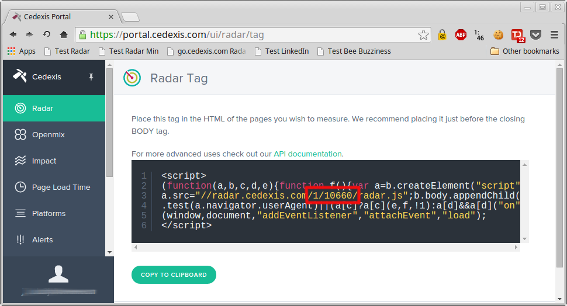

# AndroidRadar

The easiest way to get started is by adding the android-radar Maven repository
to your application's gradle build.

## Getting Started

To get up and running quickly, we'll follow these steps:

1. Add the jCenter repository.
2. Add a dependency on the android-radar library module.
3. Specify Android permissions.
4. Execute Radar sessions programmatically.

### Add the jCenter repository

First, make sure your application build.gradle file specifies the jCenter repository:

```groovy
repositories {
    jcenter()
}
```

Alternatively, you can also specify this in the project build.gradle file like this:

```groovy
allprojects {
    repositories {
        jcenter()
    }
}
```

### Add dependency on android-radar module

In your application grade.build file, add a line to the `dependencies` section
indicating the android-radar library.  The latest version available: [  ](https://bintray.com/jacob/maven/android-radar/_latestVersion)

```groovy
// replace x, y and z with the latest version of the AndroidRadar library.
dependencies {
    ...
    compile 'com.cedexis:android-radar:x.y.z'
}
```

### Add permissions to AndroidManifest.xml

The Radar client requires a couple of permissions in order to get its work done.
These should be added to your application's AndroidManifest.xml file, inside the
root <manifest> element and before <application> element:

```xml
<uses-permission android:name="android.permission.INTERNET" />
<uses-permission android:name="android.permission.ACCESS_NETWORK_STATE"/>
```

See the sample application's [AndroidManifest.xml](https://github.com/cedexis/AndroidRadar/blob/master/app/src/main/AndroidManifest.xml) for a complete example.

### Execute Radar sessions

Select one or more appropriate spots in your application code where you would
like to execute a Radar session.  Since every application is different, it's
hard to suggest a one-size-fits-all approach.  You'd like to strike a balance
between allowing Radar to do too much network activity and not enough.  In
general, if your application spends most of its time on a particular activity,
then that activity's onResume method is a good place to start.

To invoke a Radar session, simply insert the following code, here shown being
placed in an activity's overridden onResume method.

```java
@Override
protected void onResume() {
    Intent radarService = new Intent(this, RadarService.class);
    radarService.putExtra(
        RadarService.EXTRA_SESSION_PROPERTIES,
        new RadarSessionProperties(1, <your customer id>));
    startService(radarService);

    super.onResume();
}
```

That's it.  Now every time the user navigates or returns to that activity, a
Radar session will fire.

Note that the RadarSessionProperties constructor requires at least two integer
arguments, namely your Cedexis zone and customer ids.  You may already know
these from correspondence with our team.  In a pinch, these can be obtained
when logged into the Cedexis Portal at https://portal.cedexis.com/ui/radar/tag.
This page shows the JavaScript Radar tag with your zone and customer ids
embedded.



The two numbers in the URL (enclosed by the red box in the screenshot above) are
your zone id and customer id, respectively.

## Impact

Impact is not currently supported from the Radar Android SDK. Support will be included in future releases and documentation for using Impact will be added when it is available from the SDK. 
